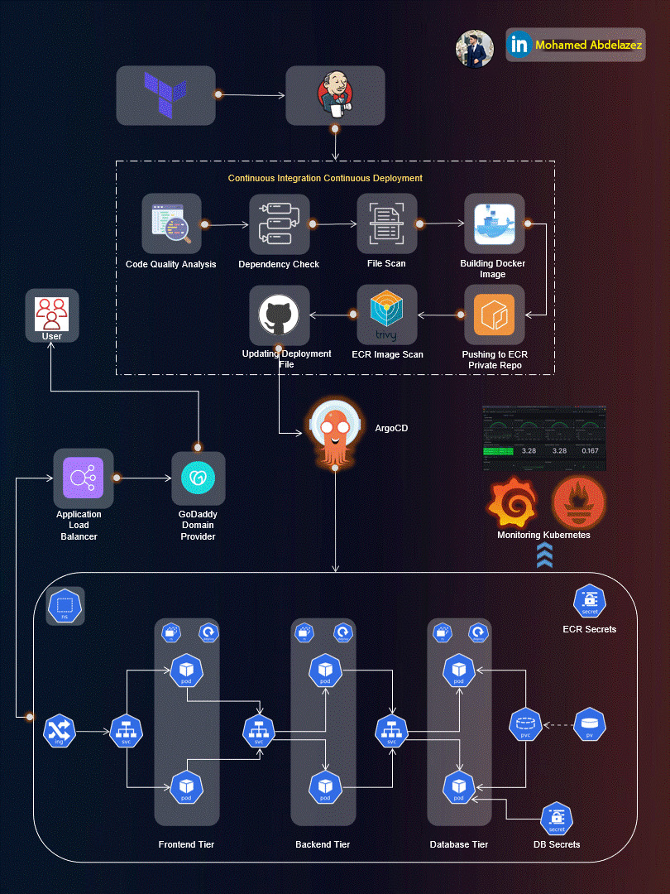

# Three-Tier Web Application Deployment on AWS EKS using AWS EKS, ArgoCD, Prometheus, Grafana, and Jenkins

Welcome to the Three-Tier Web Application Deployment project! 🚀

This repository hosts the implementation of a Three-Tier Web App using ReactJS, NodeJS, and MongoDB, deployed on AWS EKS. The project covers a wide range of tools and practices for a robust and scalable DevOps setup.

## Table of Contents

- [Application Code](#application-code)
- [Jenkins Pipeline Code](#jenkins-pipeline-code)
- [Jenkins Server Terraform](#jenkins-server-terraform)
- [Kubernetes Manifests Files](#kubernetes-manifests-files)
- [Project Details](#project-details)

## Application Code

The `Application-Code` directory contains the source code for the Three-Tier Web Application. Dive into this directory to explore the frontend and backend implementations.

## Jenkins Pipeline Code

In the `Jenkins-Pipeline-Code` directory, you'll find Jenkins pipeline scripts. These scripts automate the CI/CD process, ensuring smooth integration and deployment of your application.

## Jenkins Server Terraform

Explore the `Jenkins-Server-TF` directory to find Terraform scripts for setting up the Jenkins Server on AWS. These scripts simplify the infrastructure provisioning process.

## Kubernetes Manifests Files

The `Kubernetes-Manifests-Files` directory holds Kubernetes manifests for deploying your application on AWS EKS. Understand and customize these files to suit your project needs.

## Project Details

🛠️ **Tools Explored:**

- Terraform & AWS CLI for AWS infrastructure
- Jenkins, Sonarqube, Terraform, Kubectl, and more for CI/CD setup
- Helm, Prometheus, and Grafana for Monitoring
- ArgoCD for GitOps practices

🚢 **High-Level Overview:**

- IAM User setup & Terraform magic on AWS
- Jenkins deployment with AWS integration
- EKS Cluster creation & Load Balancer configuration
- Private ECR repositories for secure image management
- Helm charts for efficient monitoring setup
- GitOps with ArgoCD - the cherry on top!

Getting Started

To get started with this project, refer to our comprehensive guide that walks you through IAM user setup, infrastructure provisioning, CI/CD pipeline configuration, EKS cluster creation, and more.

https://medium.com/@mohamedabdelazizk10/complete-end-to-end-devsecops-kubernetes-three-tier-project-using-aws-eks-argocd-prometheus-0f1cfdcfe4c3

📈 **The journey covered everything from setting up tools to deploying a Three-Tier app, ensuring data persistence, and implementing CI/CD pipelines.**

## Contributing

We welcome contributions! If you have ideas for enhancements or find any issues, please open a pull request or file an issue.

Happy Coding! 🚀

# C-Users-amama-Desktop-Advanced-E2E-DevSecOps-Three-tier-Project-DigitalOcean

# How To Install TLS/SSL on Docker Nginx Container With Let’s Encrypt

## Step 1: Install Certbot

- To use Let’s Encrypt to obtain an SSL certificate, the first step is to install Certbot on your server.
- Install Certbot with apt and follow the prompts by selecting ok or entering Yes where required.
  $ sudo apt update
  $ sudo apt install certbot

## Step 2: Obtain TSL/SSL Certificate

$ sudo certbot certonly --webroot --webroot-path /your/project/root/public/directory/path -d example.com

% if this is your first time running certbot, you will be prompted to enter your email address and agree to the service terms.

Saving debug log to /var/log/letsencrypt/letsencrypt.log
Enter email address (used for urgent renewal and security notices)
(Enter 'c' to cancel): test@mail.com

---

Please read the Terms of Service at
https://letsencrypt.org/documents/LE-SA-v1.3-September-21-2022.pdf. You must
agree in order to register with the ACME server. Do you agree?

---

(Y)es/(N)o: Y

% If this command you just run is successful, certbot will ask how you would like to redirect traffic to HTTPS.
Please choose whether or not to redirect HTTP traffic to HTTPS, removing HTTP access.

---

1: No redirect - Make no further changes to the webserver configuration.
2: Redirect - Make all requests redirect to secure HTTPS access. Choose this for
new sites, or if you're confident your site works on HTTPS. You can undo this
change by editing your web server's configuration.

---

Select the appropriate number [1-2] then [enter] (press 'c' to cancel):

% Hit the Enter Key when you are done making your choice. If successful, you should get a message that looks like this:

## IMPORTANT NOTES:

- Congratulations! Your certificate and chain have been saved at:
  /etc/letsencrypt/live/example.com/fullchain.pem
  Your key file has been saved at:
  /etc/letsencrypt/live/example.com/privkey.pem
  Your cert will expire on 2023-07-18. To obtain a new or tweaked
  version of this certificate in the future, simply run certbot again
  with the "certonly" option. To non-interactively renew _all_ of
  your certificates, run "certbot renew"
- If you like Certbot, please consider supporting our work by:

  Donating to ISRG / Let's Encrypt: https://letsencrypt.org/donate
  Donating to EFF: https://eff.org/donate-le

## Step 3: Copy The TSL/SSL Certificates

% - Your certificates have been downloaded in this directory
% /etc/letsencrypt/live/example.com/. You will need to copy out the certificates to a new directory /etc/letsencrypt with any symbolic links encountered in the source directory using the -L option so that the contents of the linked files are copied rather than just the link itself.%

$ sudo mkdir -p /etc/letsencrypt/ssl #create an SSL directory to save the fullchain and privkey files

$ sudo cp -r -L /etc/letsencrypt/live/example.com/fullchain.pem /etc/letsencrypt/ssl/
$ sudo cp -r -L /etc/letsencrypt/live/example.com/privkey.pem /etc/letsencrypt/ssl/

<!-- You might want to give the necessary permissions so that the certificates in the new directory are read only by a specific user and group as thus: -->

$ sudo chown <nginx_user>:<nginx_group> /etc/letsencrypt/ssl/fullchain.pem
$ sudo chown <nginx_user>:<nginx_group> /etc/letsencrypt/ssl/privkey.pem

## Step 4: Update Docker-compose File

You should create another file and name it docker-compose-production.yml, assuming you already have a docker-compose.yml file you use locally. This is to differentiate the production docker-compose file, which would have the certificates referenced by paths.

So here is what your docker-compose-production.yml should look like after updating it.
{
nginx:
container_name: example_nginx_prod
image: nginx:latest
ports: - "${SSL_PORT}:443"
            - "${HTTP_PORT}:80"
volumes: - ./:/your/project/root/directory/path - /etc/letsencrypt/ssl/fullchain.pem:/etc/nginx/ssl/fullchain.pem - /etc/letsencrypt/ssl/privkey.pem:/etc/nginx/ssl/privkey.pem
}

## Step 5: Update Your Nginx conf

server {
listen [::]:443 ssl;
listen 443 ssl;

    root /your/project/root/public/directory/path;
    index index.html index.php index.htm index.nginx-debian.html;
    error_log  /var/log/nginx/error.log;
    access_log /var/log/nginx/access.log;

    server_name example.com;

    ssl_certificate /etc/nginx/ssl/fullchain.pem;
    ssl_certificate_key /etc/nginx/ssl/privkey.pem;

    error_page 404 /index.php;

    location / {
        try_files $uri $uri/ /index.php?$query_string;
    }

}

